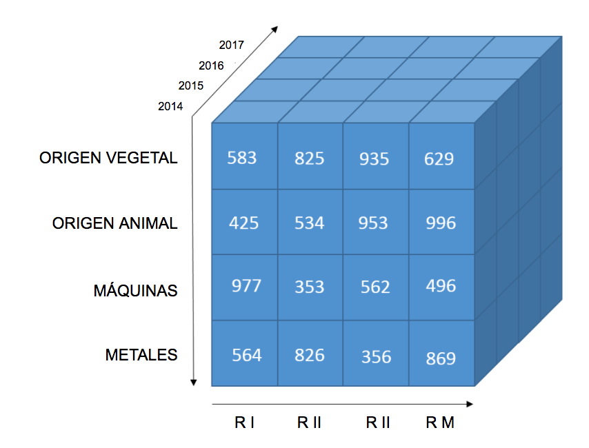

# Datachile Mondrian

Es la implementación de la capa lógica usando [Mondrian REST](https://github.com/jazzido/mondrian-rest) para Datachile.

Contiene la configuración del esquema de cubos y provee el entrypoint REST de la API para consultas.

Documentación completa para crear un schema aquí: [Mondrian Schema](https://mondrian.pentaho.com/documentation/schema.php)

## Repositorios relacionados de DataChile

*   [ETL para DataChile](https://github.com/Datawheel/datachile-etl)
*   [API Mondrian para DataChile](https://github.com/Datawheel/datachile-mondrian)
*   [Sitio web para DataChile](https://github.com/Datawheel/datachile)

## Para desarrollo local
1. Instalar [JRuby](http://jruby.org). Usar [RVM](https://rvm.io/) es recomendado.
2. Instalar dependencias con `bundle install`
3. Ejecutar `jruby -G -S jbundle install`
4. Duplicar `config.yaml.example` bajo el nombre `config.yaml` y completar los datos.
5. Correr server `JRUBY_OPTS=-G MONDRIAN_REST_CONF=`pwd`/config.yaml MONDRIAN_REST_SECRET=lala JAVA_OPTS="-Dlog4j.configuration=file:log4j.properties -Dmondrian.olap.SsasCompatibleNaming=true" rackup` 

## Conceptos básicos
Descripción y ejemplos de las palabras clave en Mondrian y OLAP.

* Cubes: Conjunto de dimensions y measures.
  * Matrículas educativas
  * Exportaciones
  * Resultados electorales
  * Servicio de salud
* Measures: Variable escalar asociada a un campo agregado.
  * Edad promedio
  * Cantidad de votos
  * Factor de expansión
  * Total exportado
* Dimensions: Conjunto de jerarquías.
  * Geografía
  * Industria
  * Sexo
  * Material de las paredes
* Hierarchy: Conjunto de miembros estructurados. Para saber A de región B puedo sumar todas las A de sus comunas.
  * País
  * Región
  * Comuna
* Levels: Conjunto de miembros hermanos.
  * Antofagasta
  * Maule
  * Metropolitana
  * Coquimbo
  * Valparaíso
* Members: valor dentro de dimensión determinada.
  * Femenino
  * Arica
  * Máquinas
  * 2010
  * Pesca
* Properties y Annotations: Información adicional sobre distintos tags.


## Ejemplo de cubo
En el siguiente diagrama se puede apreciar un ejemplo de cubo en donde existen 3 dimensiones:
* Años
* Regiones
* Productos



En la intersección de los ejes -cubos celestes- está la measure agregada y el valor definido que estamos buscando en este query.

## Tablas `fact_` y tablas `dim_`
El diagrama de estrella para una base de datos relacional organiza la información pensando en que:
* El centro estará la tabla de `fact`: los hechos. Las measures y datos a ser agregados más los campos de referencia tidy son parte de esta tabla.
* En las puntas de la estrella estarán las tablas de `dimensiones` relacionadas. Estas dimensiones serán mapeadas en el `schema.xml` y puedem ser compartidas entre varios cubos -como el caso de la dimensión geográfica-.

## Dimensiones en tablas vs Dimensiones inline
Las dimensiones puede ser definidas en una tabla y mapear los campos que respondan a los ids y los nombres, por ejemplo la dimensión `Geography`:

```xml
<Dimension name="Geography">
  <Annotations>
    <Annotation name="index_as">geo</Annotation>
  </Annotations>

  <Hierarchy hasAll="true" primaryKey="id">
    <Table name="dim_comunas" schema="public"/>

    <Level column="region_id" name="Region" nameColumn="region_name" uniqueMembers="true"/>

    <Level column="comuna_datachile_id" name="Comuna" nameColumn="comuna_name" uniqueMembers="true"/>
  </Hierarchy>
</Dimension>
```

... o bien -sin son pequeñas- pueden ser definidas como tablas `inline` como por ejemplo la dimensión `Sex`:

```xml
<Dimension name="Sex">
  <Annotations>
    <Annotation name="es_element_caption">Sexo</Annotation>
  </Annotations>

  <Hierarchy hasAll="true" primaryKey="sex_id">
    <InlineTable alias="dim_sex">
      <ColumnDefs>
        <ColumnDef name="sex_id" type="Numeric"/>
        <ColumnDef name="description" type="String"/>
        <ColumnDef name="es_description" type="String"/>
      </ColumnDefs>
      <Rows>
        <Row>
          <Value column="sex_id">0</Value>
          <Value column="description">No data</Value>
          <Value column="es_description">No informa</Value>
        </Row>
        <Row>
          <Value column="sex_id">2</Value>
          <Value column="description">Male</Value>
          <Value column="es_description">Masculino</Value>
        </Row>
        <Row>
          <Value column="sex_id">1</Value>
          <Value column="description">Female</Value>
          <Value column="es_description">Femenino</Value>
        </Row>
      </Rows>
    </InlineTable>

    <Level column="sex_id" name="Sex" nameColumn="description" uniqueMembers="true" caption="Sex">
      <Annotations>
        <Annotation name="es_caption">Description ES</Annotation>
        <Annotation name="es_element_caption">Sexo</Annotation>
      </Annotations>

      <Property column="es_description" name="Description ES"/>
    </Level>
  </Hierarchy>
</Dimension>
```

En general la decisión estará basada en la cantidad de `members` que tenga esa dimensión.

## i18n
Repetir datos puede ser un detalle sin importancia en las tablas `dim_` dado que OLAP siempre hará agregaciones. Pero puede multiplicarse si se necesita multilenguaje. Es la única manera de hacerlo: tener las dimensiones -y sus niveles- en varios idiomas en campos separados. Se indica el campo dentro de cada `Level` utilizando `Annotations` y `Property`.

Ejemplo de `Dimension` inline sobre grados de discapacidad:

```xml
<Dimension foreignKey="disability_grade" name="Disability Grade">
  <Annotations>
    <Annotation name="es_element_caption">Grado de discapacidad</Annotation>
  </Annotations>

  <Hierarchy hasAll="true">
    <InlineTable alias="disability_grade">
      <ColumnDefs>
        <ColumnDef name="id" type="Numeric"/>
        <ColumnDef name="description" type="String"/>
        <ColumnDef name="es_description" type="String"/>
      </ColumnDefs>
      <Rows>
        <Row>
          <Value column="id">1</Value>
          <Value column="description">No disability</Value>
          <Value column="es_description">Sin discapacidad</Value>
        </Row>
        <Row>
          <Value column="id">2</Value>
          <Value column="description">Slight to moderate</Value>
          <Value column="es_description">Leve a moderada</Value>
        </Row>
        <Row>
          <Value column="id">3</Value>
          <Value column="description">Severe</Value>
          <Value column="es_description">Severa</Value>
        </Row>
      </Rows>
    </InlineTable>

    <Level column="id" name="Disability Grade" nameColumn="description" uniqueMembers="true">
      <Annotations>
        <Annotation name="es_caption">Description ES</Annotation>
      </Annotations>

      <Property column="es_description" name="Description ES"/>
    </Level>
  </Hierarchy>
</Dimension>
```

Luego en el query habrá que solicitar el `caption` al `drilldown` basado en el nombre de la `property`.
